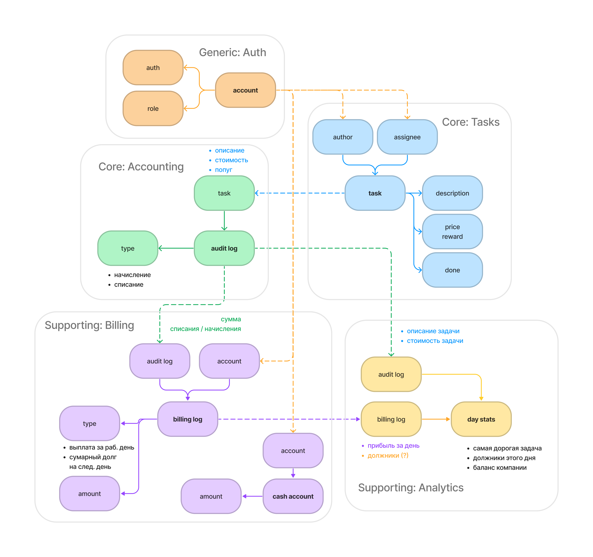
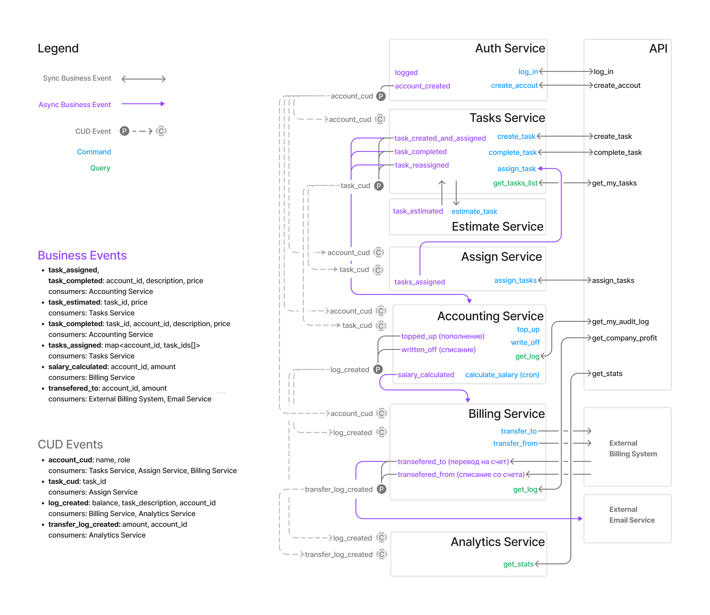

# aTES
Awesome Task Exchange System (aTES)

## Event storming
[figjam](https://www.figma.com/file/ebpT7DXiab2QKsrGreeuhF/async-arch.aTES?node-id=44%3A1131)

В процессе ES были выявлены следующие контексты:

Core
- Задачи как основной продукт, который даже можно красиво заопенсорсить
- Оценка задач - настоящий основной продукт, методика оценки задач - коммерческая тайна
- Назначение незакрытых задач - то же самое, что предыдущий пункт

Supporting
- Бухгалтерия: по задачам
- Платежи: выплата зарплаты за день, перевод долга на следующий день
- Статистика

Generic 
- Аутентификация
- Почтовый сервис
- Внешняя платежная система

## Data Model
[figjam](https://www.figma.com/file/ebpT7DXiab2QKsrGreeuhF/async-arch.aTES?node-id=43%3A1372)

- Auth
  - beak shape
  - role: parrot | accountant | manager | admin
- Tasks
  - assignee
  - description
  - price
  - reward
  - status
- Audit Log  
  - task description
  - task assignee
  - task price/reward
  - type: начисление | списание 
- Billing Log  
  В отличие от Audit Log тут хранятся записи о фактическом переводе денег попугам в конце дня.
  - account
  - amount - если отрицательный, то это сумма которую должен попуг организации за этот день
- Cash Account  
  Счет попуга.
  - account
  - amount - может быть отрицательным

## Services
[figjam](https://www.figma.com/file/ebpT7DXiab2QKsrGreeuhF/async-arch.aTES?node-id=43%3A1371)

- **Auth Service**
- **Task Service**
- **Estimate Service**  
  Сейчас он выдает случайные суммы, но потенциально это может быть обученая на статистике модель, cпособствующая еще большему закрепощению попугов.
- **Assign Service**  
  Перемешивает задачи между попугами, а потом вызывает assign_task у Tasks сервиса.
- **Accounting Service**  
  Ведет учет по задачам и содержит внутренние счета попугов.
  в конце дня тем попугам что в плюсе обнуляет внутренний счет.
- **Billing Service**  
  Сервис для взаимодействия с внешней платежной системой.
- **Analytics Service**
- **API Gateway**

### Business Events
- **task_assigned**, **task_completed**: account_id, description, price  
  producer: Task Service  
  consumers: Accounting Service  
  При назначении или завершении задачи создается соовтетсвующая запись в логах
- **task_estimated**: task_id, price  
  producer: Estimate Service  
  consumers: Tasks Service  
  Задача синхронно оценивается при создании
- **tasks_assigned**: map[account_id, task_ids]  
  producer: Assign Service  
  consumers: Tasks Service  
  Перемешивание задач между попугами  
- **salary_calculated**: account_id, amount  
  producer: Account Service  
  consumers: Billing Service
  Рассчет в конце дня  
- **transefered_to**: account_id, amount  
  producer: Billing Service  
  consumers: External Billing System, Email Service  
  Проведение платежа и отправка сообщения попугу

### CUD Events
- **account_cud**: name, role  
  consumers: Tasks Service, Assign Service, Billing Service
- **task_cud**: task_id  
  consumers: Assign Service  
- **log_created**: balance, task_description, account_id  
  consumers: Billing Service, Analytics Service
- **transfer_log_created**: amount, account_id  
  consumers: Analytics Service